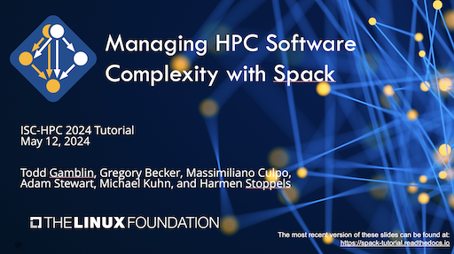

.. Copyright 2013-2023 Lawrence Livermore National Security, LLC and other
   Spack Project Developers. See the top-level COPYRIGHT file for details.

   SPDX-License-Identifier: (Apache-2.0 OR MIT)

.. _spack-101:

===================
Tutorial: Spack 101
===================

This is an introduction to Spack with lectures and live demos. It was last presented at
the `HPCIC 2024 HPC Tutorials
<https://hpcic.llnl.gov/tutorials/2024-hpc-tutorials>`_, August 6th, 2024. The event was
two online half-day tutorials.

You can use these materials to teach a course on Spack at your own site,
or you can just skip ahead and read the live demo scripts to see how
Spack is used in practice.

.. _slides:

.. rubric:: Slides

:download:`Download Slides <_static/slides/spack-pearc24-tutorial-slides.pdf>`.

**Full citation:** Todd Gamblin, Gregory Becker, Alec Scott.
Managing HPC Software Complexity with Spack.
HPCIC Tutorials 2024,
Livermore, California. July 22, 2024.

.. _video:

.. rubric:: Video

For the last video of a Spack tutorial like this one, see the `AWS/RADIUSS 2023 version
<https://spack-tutorial.readthedocs.io/en/radiuss23/>`_

.. _live-demos:

.. rubric:: Live Demos

We provide scripts that take you step-by-step through basic Spack tasks.
They correspond to sections in the slides above.

To run through the scripts, we provide the `spack/tutorial <https://ghcr.io/spack/tutorial>`_
container image. You can invoke

.. code-block:: console

   $ docker pull ghcr.io/spack/tutorial:pearc24
   $ docker run -it ghcr.io/spack/tutorial:pearc24

to start using the container. You should now be ready to run through our demo scripts:

  #. :ref:`basics-tutorial`
  #. :ref:`environments-tutorial`
  #. :ref:`configs-tutorial`
  #. :ref:`packaging-tutorial`
  #. :ref:`stacks-tutorial`
  #. :ref:`developer-workflows-tutorial`
  #. :ref:`binary-cache-tutorial`
  #. :ref:`spack-scripting-tutorial`

Other sections from past tutorials are also available, although they may
not be kept up-to-date as frequently:

  #. :ref:`modules-tutorial`
  #. :ref:`build-systems-tutorial`
  #. :ref:`advanced-packaging-tutorial`

Full contents:

.. toctree::
   :maxdepth: 2
   :caption: Links

   Main Spack Documentation <https://spack.readthedocs.io>

.. toctree::
   :maxdepth: 3
   :caption: Tutorial

   tutorial_basics
   tutorial_environments
   tutorial_configuration
   tutorial_packaging
   tutorial_stacks
   tutorial_developer_workflows
   tutorial_binary_cache
   tutorial_spack_scripting

.. toctree::
   :maxdepth: 3
   :caption: Additional sections

   tutorial_modules
   tutorial_buildsystems
   tutorial_advanced_packaging
