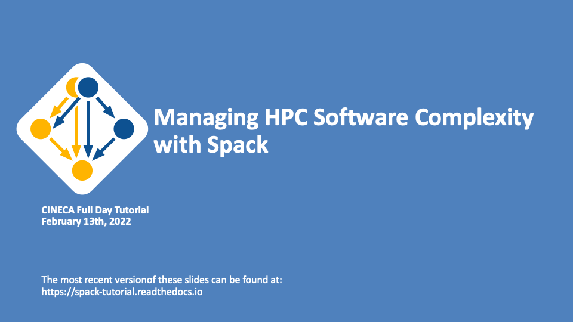

.. Copyright 2013-2021 Lawrence Livermore National Security, LLC and other
   Spack Project Developers. See the top-level COPYRIGHT file for details.

   SPDX-License-Identifier: (Apache-2.0 OR MIT)

.. _spack-101:

===================
Tutorial: Spack 101
===================

This is an introduction to Spack with lectures and live demos. It was last presented as
a hybrid event at CINECA as `Managing HPC Software Complexity with Spack
<http://www.max-centre.eu/events/cineca-admires-event-spack>`_ February
13, 2023. There is a full day of material here, along with extra sections beyond what
was presented during the tutorial.

You can use these materials to teach a course on Spack at your own site,
or you can just skip ahead and read the live demo scripts to see how
Spack is used in practice.

.. _slides:

.. rubric:: Slides

:download:`Download Slides <_static/slides/spack-cineca23-tutorial-slides.pdf>`.

**Full citation:** Massimiliano Culpo and Harmen Stoppels. Managing HPC Software Complexity with Spack.
CINECA - ADMIRE 2023. Casalecchio di Reno (BO), Italy, February 13, 2023.

.. _live-demos:

.. rubric:: Live Demos

We provide scripts that take you step-by-step through basic Spack tasks.
They correspond to sections in the slides above.

To run through the scripts, we provide the `spack/tutorial <https://ghcr.io/spack/tutorial>`_
container image. You can invoke

.. code-block::

   $ docker pull ghcr.io/spack/tutorial:cineca23
   $ docker run -it ghcr.io/spack/tutorial:cineca23

to start using the container. You should now be ready to run through our demo scripts:

  #. :ref:`basics-tutorial`
  #. :ref:`environments-tutorial`
  #. :ref:`configs-tutorial`
  #. :ref:`packaging-tutorial`
  #. :ref:`binary-cache-tutorial`
  #. :ref:`stacks-tutorial`
  #. :ref:`developer-workflows-tutorial`

Other sections from past tutorials are also available, although they may
not be kept up-to-date as frequently:

  #. :ref:`modules-tutorial`
  #. :ref:`build-systems-tutorial`
  #. :ref:`advanced-packaging-tutorial`
  #. :ref:`spack-scripting-tutorial`

Full contents:

.. toctree::
   :maxdepth: 2
   :caption: Links

   Main Spack Documentation <https://spack.readthedocs.io>

.. toctree::
   :maxdepth: 3
   :caption: Tutorial

   tutorial_basics
   tutorial_environments
   tutorial_configuration
   tutorial_packaging
   tutorial_developer_workflows
   tutorial_binary_cache
   tutorial_stacks
   tutorial_spack_scripting
   tutorial_modules
   tutorial_buildsystems
   tutorial_advanced_packaging
