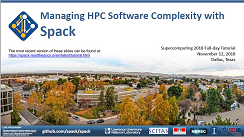

.. Copyright 2013-2019 Lawrence Livermore National Security, LLC and other
   Spack Project Developers. See the top-level COPYRIGHT file for details.

   SPDX-License-Identifier: (Apache-2.0 OR MIT)

.. _spack-101:

===================
Tutorial: Spack 101
===================

This is a full-day introduction to Spack with lectures and live demos.  It
was presented as a tutorial at `Supercomputing 2018
<http://sc18.supercomputing.org>`_.

You can use these materials to teach a course on Spack at your own site,
or you can just skip ahead and read the live demo scripts to see how
Spack is used in practice.

.. _slides:

.. rubric:: Slides

:download:`Download Slides <tutorial/slides/Spack-SC18-Tutorial.pdf>`.

**Full citation:** Todd Gamblin, Gregory Becker, Massimiliano Culpo, Matt
Legendre, Mario Melara, Peter Scheibel, and Adam Stewart.
`Managing HPC Software Complexity with Spack
<https://sc18.supercomputing.org/presentation/?id=tut165&sess=sess252>`_.
Tutorial presented at Supercomputing 2018. November 12, 2018, Dallas, TX, USA.

.. _live-demos:

.. rubric:: Live Demos

These scripts will take you step-by-step through basic Spack tasks. They
correspond to sections in the slides above.

  1. :ref:`basics-tutorial`
  2. :ref:`configs-tutorial`
  3. :ref:`packaging-tutorial`
  4. :ref:`environments-tutorial`
  5. :ref:`modules-tutorial`
  6. :ref:`build-systems-tutorial`
  7. :ref:`advanced-packaging-tutorial`

Full contents:

.. toctree::
   :maxdepth: 2
   :caption: Links

   Main Spack Documentation <https://spack.readthedocs.io>

.. toctree::
   :maxdepth: 3
   :caption: Tutorial

   tutorial_basics
   tutorial_configuration
   tutorial_packaging
   tutorial_environments
   tutorial_modules
   tutorial_buildsystems
   tutorial_advanced_packaging
