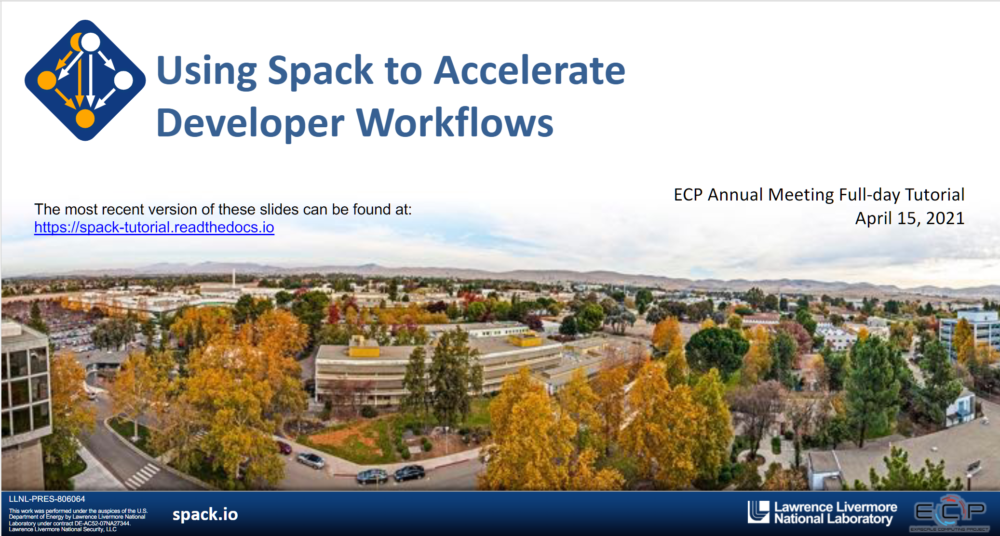

.. Copyright 2013-2021 Lawrence Livermore National Security, LLC and other
   Spack Project Developers. See the top-level COPYRIGHT file for details.

   SPDX-License-Identifier: (Apache-2.0 OR MIT)

.. _spack-101:

===================
Tutorial: Spack 101
===================

This is a half-day introduction to Spack with lectures and live demos. It was
last presented as a virtual event at the `ISC 2021 conference
<http://isc-hpc.com>`_.

If you are looking for the most recent **full day** tutorial, visit the page
for the `ECPAM 2021 <https://spack-tutorial.readthedocs.io/en/ecp21/>`_
tutorial.

You can use these materials to teach a course on Spack at your own site,
or you can just skip ahead and read the live demo scripts to see how
Spack is used in practice.

.. _slides:

.. rubric:: Slides

:download:`Download Slides <_static/slides/spack-isc21-tutorial-slides.pdf>`.

**Full citation:** Gregory Becker, Massimiliano Culpo, Todd Gamblin, Tamara
Dahlgren, and Michael Kuhn. Managing HPC Software Complexity wiht Spack.
ISC-HPC 2021. Virtual event. June 24, 2021.

.. _live-demos:

.. rubric:: Live Demos

We provide scripts that take you step-by-step through basic Spack tasks.
They correspond to sections in the slides above. You can use one of the
following methods to run through the scripts:

  1. We provide the `spack/tutorial
     <https://hub.docker.com/r/spack/tutorial>`_ container image on
     Docker Hub that you can use to do the tutorial on your local
     machine.  You can invoke ``docker run -it spack/tutorial`` to start
     using the container.

  2. When we host the tutorial, we also provision VM instances in `AWS
     <https://aws.amazon.com/>`_, so that users who are unfamiliar with
     Docker can simply log into a VPM to do the demo exercises.

You should now be ready to run through our demo scripts:

  #. :ref:`basics-tutorial`
  #. :ref:`environments-tutorial`
  #. :ref:`configs-tutorial`
  #. :ref:`developer-workflows-tutorial`
  #. :ref:`binary-cache-tutorial`

Other sections are also available, though we are skipping them for this
half-day format:

  #. :ref:`packaging-tutorial`
  #. :ref:`stacks-tutorial`
  #. :ref:`spack-scripting-tutorial`
  #. :ref:`modules-tutorial`
  #. :ref:`build-systems-tutorial`
  #. :ref:`advanced-packaging-tutorial`

Full contents:

.. toctree::
   :maxdepth: 2
   :caption: Links

   Main Spack Documentation <https://spack.readthedocs.io>

.. toctree::
   :maxdepth: 3
   :caption: Tutorial

   tutorial_basics
   tutorial_environments
   tutorial_configuration
   tutorial_packaging
   tutorial_developer_workflows
   tutorial_binary_cache
   tutorial_stacks
   tutorial_spack_scripting
   tutorial_modules
   tutorial_buildsystems
   tutorial_advanced_packaging
