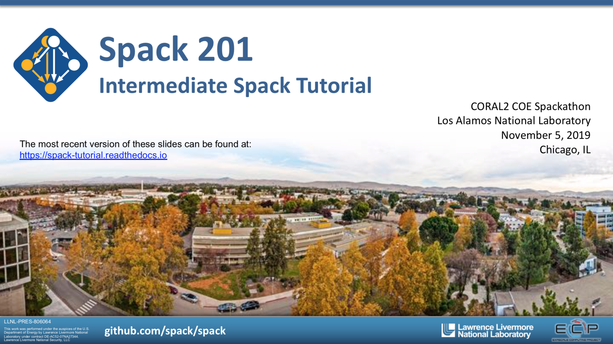

.. Copyright 2013-2019 Lawrence Livermore National Security, LLC and other
   Spack Project Developers. See the top-level COPYRIGHT file for details.

   SPDX-License-Identifier: (Apache-2.0 OR MIT)

.. _spack-101:

===================
Tutorial: Spack 201
===================

This is a half-day (3 hours of course time) intermediate tutorial on
Spack with lectures and live demos. It was originally presented at Los
Alamos National Laboratory on November 5, 2019. This tutorial assumes
users are familiar with ~75% of the content in the Spack 101 tutorial.

You can use these materials to teach a course on Spack at your own site,
or you can just skip ahead and read the live demo scripts to see how
Spack is used in practice.

.. _slides:

.. rubric:: Slides

:download:`Download Slides <tutorial/slides/spack-lanl19-tutorial-slides.pdf>`.

**Full citation:** Gregory Becker and Todd Gamblin. Intermediate Spack
Tutorial. Tutorial presented at Los Alamos National
Laboratory. November 5, 2019. Los Alamos, NM, USA.

.. _live-demos:

.. rubric:: Live Demos

We provide scripts that take you step-by-step through basic Spack
tasks.  Some of the scripts corrospond to sections in the slides
above. Other sections use only scripts, or only slides. You can use
one of the following methods to run through the scripts:

  1. We provide the `spack/tutorial
     <https://hub.docker.com/r/spack/tutorial>`_ container image on
     Docker Hub that you can use to do the tutorial on your local
     machine.  You can invoke ``docker run -it spack/tutorial`` to start
     using the container.

  2. When we host the tutorial, we also provision VM instances in `AWS
     <https://aws.amazon.com/>`_, so that users who are unfamiliar with
     Docker can simply log into a VPM to do the demo exercises.

You should now be ready to run through our demo scripts:

  #. :ref:`developer-workflows-tutorial`
  #. :ref:`environments-tutorial`
  #. :ref:`stacks-tutorial`
  #. :ref:`spack-scripting-tutorial`

Full contents:

.. toctree::
   :maxdepth: 2
   :caption: Links

   Main Spack Documentation <https://spack.readthedocs.io>

.. toctree::
   :maxdepth: 3
   :caption: Tutorial

   tutorial_developer_workflows
   tutorial_environments
   tutorial_stacks
   tutorial_spack_scripting
