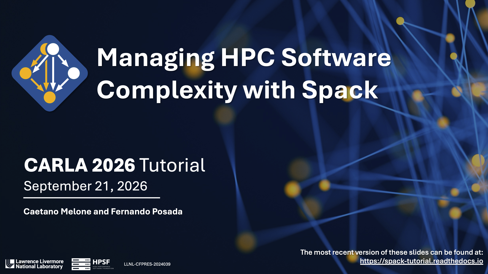

.. Copyright Spack Project Developers. See COPYRIGHT file for details.

   SPDX-License-Identifier: (Apache-2.0 OR MIT)

.. _spack-101:

===================
Tutorial: Spack 101
===================

This is an introduction to Spack with lectures and live demos.
It was last presented in-person at the `Latin American High Performance Computing Conference (CARLA 2026) <https://carlaconference.org/program-tutorials>`_ September 21st, 2026.
The event was a full-day tutorial.

You can use these materials to teach a course on Spack at your own site, or you can just skip ahead and read the live demo scripts to see how Spack is used in practice.

.. _slides:

.. rubric:: Slides

:download:`Download Slides <_static/slides/spack-carla26-tutorial-slides.pdf>`.

**Full citation:** Caetano Melone and Fernando Posada.
Managing HPC Software Complexity with Spack.
Latin American High Performance Computing Conference, Córdoba, Argentina, September 21, 2026.

.. _video:

.. rubric:: Video

For the last recorded version of this tutorial, see the `HPCIC Tutorial 2026 videos <https://hpcic.llnl.gov/tutorials/2026-hpc-tutorials/>`_.

.. _live-demos:

.. rubric:: Live Demos

We provide scripts that take you step-by-step through basic Spack tasks.
They correspond to sections in the slides above.

To run through the scripts, we provide the `spack/tutorial <https://ghcr.io/spack/tutorial>`_ container image.
You can invoke

.. code-block:: console

   $ docker pull ghcr.io/spack/tutorial:carla26
   $ docker run -it ghcr.io/spack/tutorial:carla26

to start using the container.
You should now be ready to run through our demo scripts:

#. :ref:`basics-tutorial`
#. :ref:`environments-tutorial`
#. :ref:`configs-tutorial`
#. :ref:`stacks-tutorial`
#. :ref:`packaging-tutorial`
#. :ref:`developer-workflows-tutorial`
#. :ref:`binary-cache-tutorial`
#. :ref:`spack-scripting-tutorial`

Other sections from past tutorials are also available, although they may not be kept up-to-date as frequently:

#. :ref:`modules-tutorial`
#. :ref:`build-systems-tutorial`
#. :ref:`advanced-packaging-tutorial`

Full contents:

.. toctree::
   :maxdepth: 2
   :caption: Links

   Main Spack Documentation <https://spack.readthedocs.io>

.. toctree::
   :maxdepth: 3
   :caption: Tutorial

   tutorial_basics
   tutorial_environments
   tutorial_configuration
   tutorial_stacks
   tutorial_packaging
   tutorial_developer_workflows
   tutorial_binary_cache
   tutorial_scripting

.. toctree::
   :maxdepth: 3
   :caption: Additional sections

   tutorial_modules
   tutorial_buildsystems
   tutorial_advanced_packaging
