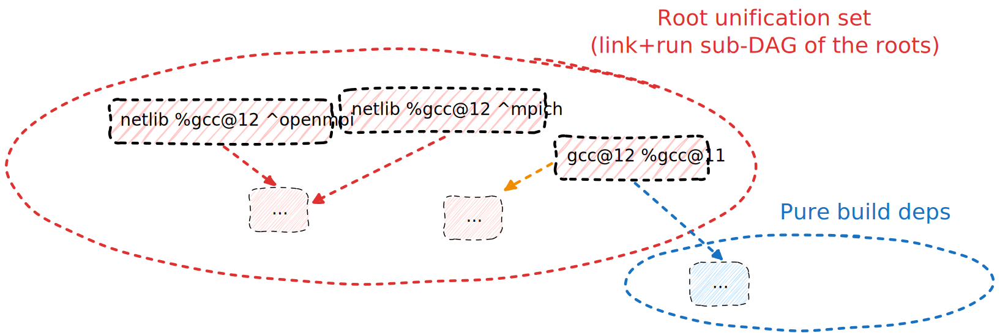

.. Copyright 2013-2023 Lawrence Livermore National Security, LLC and other
   Spack Project Developers. See the top-level COPYRIGHT file for details.

   SPDX-License-Identifier: (Apache-2.0 OR MIT)

.. include:: common/setup.rst

.. _stacks-tutorial:

===============
Stacks Tutorial
===============

So far, we've talked about Spack environments in the context of a unified user environment.
But environments in Spack have much broader capabilities. In this tutorial we will consider
how to use Spack environments to manage large deployments of software.

What usually differs between a typical environment for a single user, and an environment used
to manage large deployments, is that in the latter case we often have a set of packages we want
to install across a wide range of MPIs, LAPACKs or compilers.

In the following we'll mimic the creation of a software stack built onto a cross-product of
different LAPACK and MPI libraries, with a compiler that is more recent than the one provided
by the host system.

In the first part we'll focus on how to properly configure and install the software we want.
We'll learn how to pin certain requirements, and how to write a cross product of specs in a
compact, and expressive, way.

Then we'll consider how the software we install might be consumed by our users, and see the
two main mechanisms that Spack provides for that: views and module files.

.. note::

   Before we start this hands-on, make sure the ``EDITOR`` environment variable is set to your
   preferred editor, for instance:

   .. code-block:: console

      $ export EDITOR=emacs

------------------
Setup the compiler
------------------

The first step to build our stack is to setup the compiler we want to use later.
This is, currently, an iterative process that can be done in two ways:

 1. Install the compiler first, then register it in the environment
 2. Use a second environment just for the compiler

In the following we'll use the first approach. For people interested, an example
of the latter approach can be found `at this link <https://github.com/haampie/spack-intermediate-gcc-example/>`_.

Let's start by creating an environment in a directory of our choice:

.. literalinclude:: outputs/stacks/setup-0.out
   :language: console

Now we can add from the command line a new compiler. We'll also disable the generation of views
for the time being, as we'll come back to this topic later in the tutorial:

.. literalinclude:: outputs/stacks/setup-1.out
   :language: console

What you should see on screen now is the following ``spack.yaml`` file:

.. literalinclude:: outputs/stacks/examples/0.spack.stack.yaml
   :language: yaml
   :emphasize-lines: 9

The next step is to concretize and install our compiler:

.. literalinclude:: outputs/stacks/setup-2.out
   :language: console

Finally, let's register it as a new compiler in the environment:

.. literalinclude:: outputs/stacks/compiler-find-0.out
   :language: console

The ``spack location -i`` command returns the installation
prefix for the spec being queried:

.. literalinclude:: outputs/stacks/compiler-find-1.out
   :language: console

This might be useful in general when scripting Spack commands, as the
example above shows. Listing the compilers now shows the presence
of ``gcc@12.3.0``:

.. literalinclude:: outputs/stacks/compiler-list-0.out
   :language: console

The manifest file at this point looks like:

.. literalinclude:: outputs/stacks/examples/1.spack.stack.yaml
   :language: yaml

We are ready to build more software with our newly installed GCC!

------------------------
Install a software stack
------------------------

Now that we have a compiler ready, the next objective is to build software with it.
We'll start by trying to add different versions of ``netlib-scalapack``, linked against
different MPI implementations:

.. literalinclude:: outputs/stacks/unify-0.out
   :language: console

If we try to concretize the environment, we'll get an error:

.. literalinclude:: outputs/stacks/unify-1.out
   :language: console

The error message is quite verbose, and admittedly complicated, but at the end it gives
a useful hint:

.. code-block::

   You could consider setting `concretizer:unify` to `when_possible` or `false` to allow multiple versions of some packages.

Let's see what that means.

^^^^^^^^^^^^^^^^^^^^^^^^^^^^^^^^^^^^^^
Tuning concretizer options for a stack
^^^^^^^^^^^^^^^^^^^^^^^^^^^^^^^^^^^^^^

Whenever we concretize an environment with more than one root spec, we can configure Spack to be more
or less strict with duplicate nodes in the sub-DAG obtained by following link and run edges starting
from the roots. We usually call this sub-DAG the *root unification set*.

A diagram might help to better visualize the concept:

The image above represents the current environment, with our three root specs highlighted by a thicker
dashed line. Any node that could be reached following a link or run edge is part of the root unification
set. Pure build dependencies might fall outside of it.

The config option determining which nodes are allowed to be in the root unification set is ``concretizer:unify``.
Let's check its value:

.. literalinclude:: outputs/stacks/unify-2.out
   :language: console

``concretizer:unify:true`` means that only a single configuration for each package can be present. This value
is good for single project environments, since it ensures we can construct a view of all the software, with the
usual structure expected on a Unix-ish system, and without risks of collisions between installations.

Clearly, we can't respect this requirement, since our roots already contain two different configurations of
``netlib-scalapack``. Let's set the value to ``false``, and try to re-concretize:

.. literalinclude:: outputs/stacks/unify-3.out
   :language: console

This time concretization succeeded. Setting ``concretizer:unify:false`` is effectively concretizing each root
spec on its own, and then merging the results into the environment. This allows us to have the duplicates we need.

.. note::

   If the environment is expected to have only a few duplicate nodes, then there's another value we might consider:

   .. code-block:: console

      $ spack config add concretizer:unify:when_possible

   With this option Spack will try to unify the environment in an eager way, solving it in multiple rounds.
   The concretization at round ``n`` will contain all the specs that could not be unified at round ``n-1``,
   and will consider all the specs from previous rounds for reuse.

^^^^^^^^^^^^^
Spec matrices
^^^^^^^^^^^^^

Let's expand our stack further and consider also linking against different LAPACK providers. We could, of
course, add new specs explicitly:

.. literalinclude:: outputs/stacks/unify-4.out
   :language: console

This way of proceeding, though, will become very tedious as soon as more software is requested. The best
way to express a cross-product like this in Spack is instead through a matrix:

.. literalinclude:: outputs/stacks/examples/2.spack.stack.yaml
   :language: yaml
   :emphasize-lines: 9-13

Matrices will expand to the cross-product of their rows, so this matrix:

.. code-block:: yaml

   - matrix:
    - ["netlib-scalapack"]
    - ["^openmpi", "^mpich"]
    - ["^openblas", "^netlib-lapack"]
    - ["%gcc@12"]

is equivalent to this list of specs:

.. code-block:: yaml

   - "netlib-scalapack %gcc@12 ^openblas ^openmpi"
   - "netlib-scalapack %gcc@12 ^openblas ^mpich"
   - "netlib-scalapack %gcc@12 ^netlib-lapack ^openmpi"
   - "netlib-scalapack %gcc@12 ^netlib-lapack ^mpich"

We are now ready to concretize and install the environment:

.. literalinclude:: outputs/stacks/concretize-0.out
   :language: console

Let's double check which specs we have installed so far:

.. literalinclude:: outputs/stacks/concretize-01.out
   :language: console

As we can see we have our four variations of ``netlib-scalapack`` installed.

^^^^^^^^^^^^^^^^^^^^
Reusable definitions
^^^^^^^^^^^^^^^^^^^^

So far, we have seen how we can use spec matrices to generate cross-product specs
from rows containing a list of constraints. A common situation you will encounter
with large deployments is the necessity to add multiple matrices to the list of specs,
that possibly share some of those rows.

To reduce the amount of duplication needed in the manifest file, and thus the maintenance
burden for people maintaining it, Spack allows to *define* lists of constraints under
the ``definitions`` attribute, and expand them later when needed.
Let's rewrite our manifest in that sense:

.. literalinclude:: outputs/stacks/examples/3.spack.stack.yaml
   :language: yaml
   :emphasize-lines: 6-10,14-18

And check that re-concretizing won't change the environment:

.. literalinclude:: outputs/stacks/concretize-1.out
   :language: console

Now we can use those definitions to add e.g. serial packages built against the LAPACK libraries.
Let's try to do that by using ``py-scypy`` as an example:

.. literalinclude:: outputs/stacks/examples/4.spack.stack.yaml
   :language: yaml
   :emphasize-lines: 11,20-23

.. literalinclude:: outputs/stacks/concretize-2.out
   :language: console

Another ability that is often useful, is that of excluding specific entries from a cross-product matrix.
We can do that with the ``exclude`` keyword, in the same item as the ``matrix``. Let's try to remove
``py-scipy ^netlib-lapack`` from our matrix:

.. literalinclude:: outputs/stacks/examples/4bis.spack.stack.yaml
   :language: yaml
   :emphasize-lines: 24-25

Let's concretize the environment and install the specs once again:

.. literalinclude:: outputs/stacks/concretize-3.out
   :language: console

At this point the environment contains only ``py-scipy ^openblas``. Let's verify it:

.. literalinclude:: outputs/stacks/concretize-4.out
   :language: console

^^^^^^^^^^^^^^^^^^^^^^^
Conditional definitions
^^^^^^^^^^^^^^^^^^^^^^^

Spec list definitions can also be conditioned on a ``when`` clause. The ``when`` clause
is a python conditional that is evaluated in a restricted environment. The variables
available in ``when`` clauses are:

================= ===========
variable name     value
================= ===========
``platform``      The spack platform name for this machine
``os``            The default spack os name and version string for this machine
``target``        The default spack target string for this machine
``architecture``  The default spack architecture string platform-os-target for this machine
``arch``          Alias for ``architecture``
``env``           A dictionary representing the users environment variables
``re``            The python ``re`` module for regex
``hostname``      The hostname of this node
================= ===========

Let's say we only want to limit to just use ``mpich``, unless the ``SPACK_STACK_USE_OPENMPI``
environment variable is set. To do so we could write the following ``spack.yaml``:

.. literalinclude:: outputs/stacks/examples/5.spack.stack.yaml
   :language: yaml
   :emphasize-lines: 7-9

Different definitions of lists with the same name are concatenated, so we can define our MPI list
in one place unconditionally, and then conditionally append one or more values to it.

Let's first check what happens when we concretize and don't set any environment variable:

.. literalinclude:: outputs/stacks/concretize-5.out
   :language: console

As we expected now we are only using ``mpich`` as an MPI provider. To get ``openmpi`` back
we just need to set the appropriate environment variable:

.. literalinclude:: outputs/stacks/concretize-6.out
   :language: console

.. TODO: create a mirror of the software stack, version spack.yaml and lockfile etc.

-----------------------------------
Make the software stack easy to use
-----------------------------------

^^^^^^^^^^^^^^^^
View descriptors
^^^^^^^^^^^^^^^^

We told Spack not to create a view for this stack earlier because
simple views won't work with stacks. We've been concretizing multiple
packages of the same name -- they will conflict if linked into the
same view.

To work around this, we will use a view descriptor. This allows us to
define how each package is linked into the view, which packages are
linked into the view, or both. Let's edit our ``spack.yaml`` file again.

.. literalinclude:: outputs/stacks/examples/6.spack.stack.yaml
   :language: yaml
   :emphasize-lines: 28-38

When we'll concretize again we'll see packages linked into the view:

.. literalinclude:: outputs/stacks/view-0.out
   :language: console

The view descriptor also contains a ``link`` key, which is either
"all" or "roots". The default behavior, as we have seen, is to link
all packages, including implicit dependencies, into the view. The
"roots" option links only root packages into the view.

.. literalinclude:: outputs/stacks/examples/7.spack.stack.yaml
   :language: yaml
   :emphasize-lines: 33

.. literalinclude:: outputs/stacks/view-1.out
   :language: console

Now we see only the root libraries in the default view.
The rest are hidden, but are still available in the full view.

^^^^^^^^^^^^
Module files
^^^^^^^^^^^^

Module files are another very popular way to let your end users profit from
the software you installed. Here we'll  show how you can incorporate the configuration
to generate LMod hierarchical module files within the same environment used to
install the software.

.. note::

   A more in-depth tutorial, focused only on module files, can be found at :ref:`modules-tutorial`.
   There we discuss the general architecture of module file generation in Spack and we highlight
   differences between ``environment-modules`` and ``lmod`` that won't be covered in this section.

Let's start by adding ``lmod`` to the software installed with the system compiler:

.. code-block:: console

   $ spack add lmod%gcc@11
   $ spack concretize
   $ spack install

Once that is done, let's add the ``module`` command to our shell like this:

.. code-block:: console

   $ . $(spack location -i lmod)/lmod/lmod/init/bash

If everything worked out correctly you should now have the module command available in you shell:

.. literalinclude:: outputs/stacks/modules-1.out
   :language: console

The next step is to add some basic configuration to our ``spack.yaml`` to generate module files:

.. literalinclude:: outputs/stacks/examples/8.spack.stack.yaml
   :language: yaml
   :emphasize-lines: 45-54

In these few lines of additional configuration we told Spack to generate ``lmod`` module files
in a subdirectory named ``modules``, using a hierarchy comprising both ``lapack`` and ``mpi``.

We can generate the module files and use them with the following commands:

.. code-block:: console

   $ spack module lmod refresh -y
   $ module use $PWD/modules/linux-ubuntu22.04-x86_64/Core

Now we should be able to see the module files that have been generated:

.. literalinclude:: outputs/stacks/modules-2.out
   :language: console

The sets of modules is already usable, and the hierarchy already works. For instance we can
load the ``gcc`` compiler and check that we have ``gcc`` in out path and we have a lot more
modules available - all the ones compiled with ``gcc@12.3.0``:

.. literalinclude:: outputs/stacks/modules-3.out
   :language: console

There are a few issues though. For once, we have a lot of modules generated from dependencies
of ``gcc`` that are cluttering the view, and won't likely be needed directly by users. Then, module
names contain hashes, which go against users being able to reuse the same script in similar, but
not equal, environments.

Also, some of the modules might need to set custom environment variables, which are specific to
the deployment aspects that don't enter the hash - for instance a policy at the deploying site.

To address all these needs we can complicate out ``modules`` configuration a bit more:

.. literalinclude:: outputs/stacks/examples/9.spack.stack.yaml
   :language: yaml
   :emphasize-lines: 55-70

Let's regenerate the modules once again:

.. literalinclude:: outputs/stacks/modules-4.out
   :language: console

Now we have a set of module files without hashes, with a correct hierarchy, and with all our custom modifications:

.. literalinclude:: outputs/stacks/modules-5.out
   :language: console
