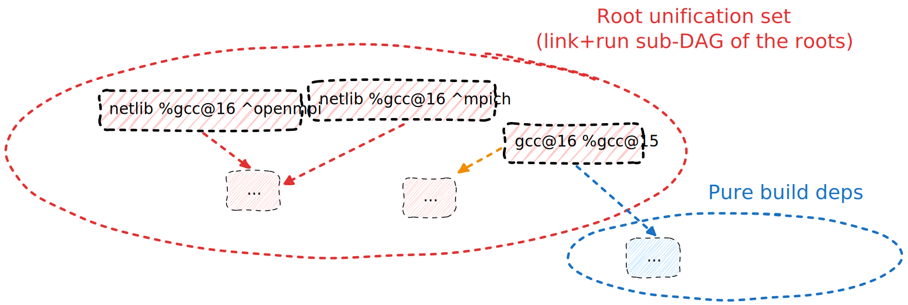

.. Copyright Spack Project Developers. See COPYRIGHT file for details.

   SPDX-License-Identifier: (Apache-2.0 OR MIT)

.. include:: common/setup.rst

.. _stacks-tutorial:

===============
Stacks Tutorial
===============

Spack environments are a powerful tool not just for managing a single user's project, but for deploying entire software stacks.
In this tutorial we will see how to use them to manage large deployments, a common pattern in HPC centers.

What usually characterizes these deployments, compared to a typical single-user environment, is the need to provide the same set of packages built against a variety of configurations: different MPI libraries, LAPACK implementations, or compilers.

Below, we'll build a representative example of such a deployment.
Our goal is to install ``netlib-scalapack`` compiled with ``gcc@16``, which is newer than the system-provided ``gcc@15``, and linked against:

- two MPI libraries (``openmpi`` and ``mpich``)
- two LAPACK providers (``openblas`` and ``netlib-lapack``)

We'll also install ``py-scipy`` linked against ``openblas``.

We'll first focus on how to configure and install the software correctly.
Then we'll discuss how to make it accessible to users through filesystem views and module files.

----------------------------
Installing a Software Stack
----------------------------

Let's start by creating an environment in a directory of our choice:

.. literalinclude:: outputs/stacks/setup-0.out
   :language: console

The first step is to install the compiler we want to use.
Let's write a minimal ``spack.yaml`` that contains just the compiler and ``lmod``, which we'll need later to generate module files:

.. literalinclude:: outputs/stacks/examples/compiler.spack.stack.yaml
   :language: yaml

Concretize and install:

.. literalinclude:: outputs/stacks/compiler-0.out
   :language: console

^^^^^^^^^^^
Spec groups
^^^^^^^^^^^

We are now ready to build the software stack on top of this compiler.
To do that cleanly, we'll use *spec groups*, which allow you to organize specs into named collections, each with its own configuration and concretization order.

Let's start with a single spec and a two-group ``spack.yaml``:

.. literalinclude:: outputs/stacks/examples/groups-0.spack.stack.yaml
   :language: yaml
   :emphasize-lines: 7-14

The environment declares two groups:

1. The ``compiler`` group contains GCC 16 and ``lmod`` (both already installed).
2. The ``stack`` group lists the software we want to deploy.

The ``needs: [compiler]`` declaration ensures that the ``compiler`` group is always concretized *before* the ``stack`` group, making its specs available for reuse.

Let's concretize to see this in action:

.. literalinclude:: outputs/stacks/groups-0.out
   :language: console

Notice that the ``compiler`` group is processed first, and ``gcc@16`` is immediately reused by the ``stack`` group.

We just used ``%gcc@16`` to pin the compiler, but it's a coarse constraint that must be repeated on every spec and does not distinguish between C, C++, and Fortran compilers.
Spec groups offer a better tool: the ``override`` block, which scopes any Spack configuration to a single group.

.. literalinclude:: outputs/stacks/examples/groups-1.spack.stack.yaml
   :language: yaml
   :emphasize-lines: 11-18,23-30

Here we used the ``override`` block to set compiler preferences at the language level, once for each group:

1. The ``compiler`` group prefers ``gcc@15``
2. The ``stack`` group prefers ``gcc@16``

These language preferences are expressed once and apply automatically to every spec in the group.

^^^^^^^^^^^^^^^^^^^^^^^^^^
Tuning concretizer options
^^^^^^^^^^^^^^^^^^^^^^^^^^

Now we add a second MPI variant to the stack, listing both ``^openmpi`` and ``^mpich`` variants of ``netlib-scalapack``:

.. literalinclude:: outputs/stacks/examples/0.spack.stack.yaml
   :language: yaml
   :emphasize-lines: 22-23

The ``stack`` group now has two conflicting configurations, so, before concretizing, let's check the ``concretizer:unify`` option:

.. literalinclude:: outputs/stacks/unify-2.out
   :language: console

With ``unify: true``, the concretizer restricts the environment to a single configuration of each package within its *root unification set*: the nodes reachable from the root specs via link or run edges.
Pure build dependencies, which fall outside the set, are not affected:

This is the right default for a single-user environment, since it ensures a filesystem view can be built without conflicts.
A software stack, however, requires multiple configurations of the same package by design, so we need to relax this constraint.

Since only the ``stack`` group has conflicting configurations, we add ``unify: false`` to its ``override`` block and concretize:

.. literalinclude:: outputs/stacks/examples/1.spack.stack.yaml
   :language: yaml
   :emphasize-lines: 32-33

.. literalinclude:: outputs/stacks/unify-3.out
   :language: console

With ``unify: false``, Spack concretizes each root spec independently and merges the results, which is exactly what a software stack needs.

.. note::

   If the stack is expected to have only a few duplicate nodes, ``when_possible`` is a less aggressive alternative:

   .. code-block:: yaml

      override:
        concretizer:
          unify: when_possible

   With this option Spack tries to unify the group in an eager, multi-round process.
   The concretization at round ``n`` contains all the specs that could not be unified at round ``n-1``, and considers all the specs from previous rounds for reuse.

^^^^^^^^^^^^^
Spec matrices
^^^^^^^^^^^^^

Let's further expand our stack to link against different LAPACK providers as well.
Adding them explicitly would be tedious, so we use a *matrix* to express the cross-product compactly:

.. literalinclude:: outputs/stacks/examples/2.spack.stack.yaml
   :language: yaml
   :emphasize-lines: 22-25

A matrix expands to the cross-product of its rows.
This matrix:

.. code-block:: yaml

   - matrix:
     - [netlib-scalapack]
     - [^openmpi, ^mpich]
     - [^openblas, ^netlib-lapack]

is equivalent to this explicit list of specs:

.. code-block:: yaml

   - "netlib-scalapack ^openblas ^openmpi"
   - "netlib-scalapack ^openblas ^mpich"
   - "netlib-scalapack ^netlib-lapack ^openmpi"
   - "netlib-scalapack ^netlib-lapack ^mpich"

No compiler annotation appears in the matrix rows: the ``override`` block in the ``stack`` group handles that.
Let's concretize to verify our four variants:

.. literalinclude:: outputs/stacks/concretize-0.out
   :language: console

We now have four variations of ``netlib-scalapack`` ready to install.

^^^^^^^^^^^^^^^^^^^^
Reusable definitions
^^^^^^^^^^^^^^^^^^^^

So far each matrix row has been written out inline.
When multiple matrices share rows, duplicating them becomes a maintenance burden.
Spack allows *defining* lists of constraints under the ``definitions`` attribute and reusing them across matrices.
Let's rewrite our manifest using definitions:

.. literalinclude:: outputs/stacks/examples/3.spack.stack.yaml
   :language: yaml
   :emphasize-lines: 6-9,27-30

Concretizing confirms the result is identical:

.. literalinclude:: outputs/stacks/concretize-1.out
   :language: console

Now that we have definitions, we can add a second matrix for serial packages that link against LAPACK but not MPI.
In a real deployment this list might include many packages, but here we use just ``py-scipy`` as an example.
Not every combination is meaningful though: ``py-scipy ^netlib-lapack`` is not a useful build, so we use ``exclude`` to drop that specific entry from the cross-product:

.. literalinclude:: outputs/stacks/examples/4bis.spack.stack.yaml
   :language: yaml
   :emphasize-lines: 10,32-36

Concretize the environment again:

.. literalinclude:: outputs/stacks/concretize-3.out
   :language: console

The exclusion worked: the environment contains only ``py-scipy ^openblas``.

^^^^^^^^^^^^^^^^^^^^^^^
Conditional definitions
^^^^^^^^^^^^^^^^^^^^^^^

A common need in multi-site or multi-cluster deployments is enabling different software sets based on environment variables or host properties.
Definitions support a ``when`` clause for exactly this.
``when`` is a Python expression evaluated at concretization time, with access to the following variables:

================= ===========
variable name     value
================= ===========
``platform``      The spack platform name for this machine
``os``            The default spack os name and version string for this machine
``target``        The default spack target string for this machine
``architecture``  The default spack architecture string platform-os-target for this machine
``arch``          Alias for ``architecture``
``env``           A dictionary representing the user's environment variables
``re``            The python ``re`` module for regex
``hostname``      The hostname of this node
================= ===========

Suppose we want to build with ``mpich`` by default, and add ``openmpi`` when a site-specific environment variable is set.
We can express this with two definitions of ``mpis``, the second guarded by a ``when`` clause:

.. literalinclude:: outputs/stacks/examples/5.spack.stack.yaml
   :language: yaml
   :emphasize-lines: 7-9

When multiple definitions share the same name, they are concatenated, so the conditional entry simply appends ``openmpi`` to the list when the variable is set.

First, concretize without the variable:

.. literalinclude:: outputs/stacks/concretize-5.out
   :language: spec

Only ``mpich`` is used.
Now set the variable and re-concretize:

.. literalinclude:: outputs/stacks/concretize-6.out
   :language: console

Both MPI providers are now active.

We now have a complete, well-structured environment.
It's time to install it:

.. literalinclude:: outputs/stacks/install-0.out
   :language: console

^^^^^^^^^^^^^^^^^^^^^
Other useful features
^^^^^^^^^^^^^^^^^^^^^

Before moving to views and modules, two other features are worth knowing about.

The first is source mirrors.
When the environment is active, creating one is as simple as:

.. code-block:: console

   $ spack mirror create --all -d ./stacks-mirror

This fetches all the tarballs listed in ``spack.lock`` into the given directory.
You can then move the mirror to an air-gapped machine and register it with:

.. code-block:: console

   $ spack mirror add <name> <stacks-mirror>

This lets you rebuild the specs from source on the target machine.
Alternatively, to create a buildcache you can:

.. code-block:: console

   $ spack gpg create <name> <e-mail>
   $ spack buildcache push ./mirror

Don't forget to set an appropriate value for the padding of the install tree; see `how to set up relocation <https://spack.readthedocs.io/en/latest/binary_caches.html#relocation>`_ in our documentation.

--------------------------
Multiple Filesystem Views
--------------------------

Views give users access to the installed software through standard filesystem paths, without requiring them to interact with Spack directly.
A stack, however, contains multiple configurations of the same package, which would conflict in a single merged directory tree.
Instead, we define *multiple views*, each covering a curated subset of the stack, with optional projections that control the directory layout.

Let's add view descriptors to our ``spack.yaml``:

.. literalinclude:: outputs/stacks/examples/6.spack.stack.yaml
   :language: yaml
   :emphasize-lines: 49-62

We defined two views, ``default`` and ``full``.
The ``default`` view consists of all the packages compiled with ``gcc@16``, excluding those that depend on ``mpich`` or ``netlib-lapack``.
View descriptors accept both ``select`` and ``exclude`` constraints.

The ``full`` view uses a more complex projection to place each spec into an appropriate subdirectory, according to the first constraint that matches.
``all`` is the default projection and always has the lowest priority, regardless of the order in which it appears.
To avoid confusion, we advise always keeping it last in projections.

Concretize to regenerate the views and check their structure:

.. literalinclude:: outputs/stacks/view-0.out
   :language: console

By default, a view includes all packages, link and run dependencies included.
Setting ``link: roots`` restricts it to root specs only:

.. literalinclude:: outputs/stacks/examples/7.spack.stack.yaml
   :language: yaml
   :emphasize-lines: 54

.. literalinclude:: outputs/stacks/view-1.out
   :language: console

Now we see only the root packages in the default view.
The rest are hidden, but are still available in the full view.
Full documentation on views is available in the `Spack environments guide <https://spack.readthedocs.io/en/latest/environments.html#environment-views>`_.

------------
Module Files
------------

Module files are the standard mechanism for managing multiple software versions on HPC systems.
In this section we'll show how to configure and generate a hierarchical module structure with ``lmod``.

.. note::

   A more in-depth tutorial, focused only on module files, can be found at :ref:`modules-tutorial`.
   It covers the general architecture and differences between ``environment-modules`` and ``lmod`` that are out of scope here.

Since ``lmod`` is already part of our compiler group and has been installed, we just need to add the ``module`` command to our shell:

.. code-block:: console

   $ . $(spack location -i lmod)/lmod/lmod/init/bash

You should now have the ``module`` command available:

.. literalinclude:: outputs/stacks/modules-1.out
   :language: console

The next step is to add some basic configuration to our ``spack.yaml`` to generate module files:

.. literalinclude:: outputs/stacks/examples/8.spack.stack.yaml
   :language: yaml
   :emphasize-lines: 50-61

This configuration tells Spack to:

- generate ``lmod`` module files under ``modules/``, with a hierarchy based on ``mpi`` and ``lapack``
- place all specs built with the system compiler (``%gcc@15``) into the ``Core`` designation

We can generate the module files and use them with the following commands:

.. code-block:: console

   $ spack module lmod refresh -y
   $ module use $PWD/stacks/modules/linux-ubuntu26.04-x86_64/Core

Let's check the generated module files:

.. literalinclude:: outputs/stacks/modules-2.out
   :language: console

The set of modules is already usable, and the hierarchy already works.
For instance, we can load the ``gcc`` compiler and check that ``gcc`` is in our path and that many modules are available, all compiled with ``gcc@16``:

.. literalinclude:: outputs/stacks/modules-3.out
   :language: console

The default configuration has a few rough edges, though:

- dependency modules from ``gcc`` clutter the listing with packages users will never load directly
- hashes in module names make scripts non-portable across similar environments
- some modules may need custom environment variables specific to site policy

To address all these needs, we can extend our ``modules`` configuration:

.. literalinclude:: outputs/stacks/examples/9.spack.stack.yaml
   :language: yaml
   :emphasize-lines: 62-78

Regenerate the modules:

.. literalinclude:: outputs/stacks/modules-4.out
   :language: console

Now we have module files without hashes, a correct hierarchy, and our custom environment variables:

.. literalinclude:: outputs/stacks/modules-5.out
   :language: console

This concludes the stacks tutorial.

-------
Summary
-------

In this tutorial we built a realistic HPC software stack: a cross-product of MPI and LAPACK libraries, compiled with a newer compiler than the system default.
Along the way we used:

- **Spec groups** with ``needs`` and ``override`` to control build order and compiler selection per group
- **Spec matrices** and **definitions** to express the cross-product concisely
- **Conditional definitions** to make the MPI selection configurable at concretization time
- **Filesystem views** and **module files** to make the software accessible to users
